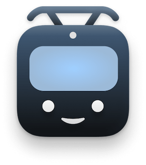

# CVAG Abfahrtsmonitor

### About

CVAG Abfahrtsmonitor is a minimal iOS App displaying [CVAG](https://www.cvag.de/) departure times to help you navigate the Chemnitz area. The same data can be accessed using CVAG's [Echtzeitauskunft](https://www.cvag.de/de/Fahrplan/Echtzeitauskunft_5779.html). 

Build entirely with ✨**SwiftUI**✨ as I tried to learn the basics of Swift and SwiftUI.

If you like the project, please star it and follow me on GitHub.

## Compatibility

- iOS 15.2 and above.

## Contribute

Any contributions to this app are welcome! Feel free to contribute by filing issues, bugs and PRs.

##

Made with 💙 in Chemnitz

### ✌️
